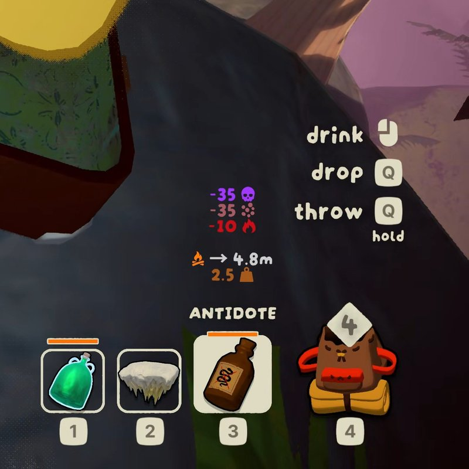

# VeeItemInfo

A BepInEx 5 mod for [PEAK](https://store.steampowered.com/app/3527290/PEAK/). It shows an
overlay describing the item you are holding — status changes, reach, cooking, weight — in
numbers and the game's own icons, which the game itself does not do.



A fork of [ItemInfoDisplay](https://github.com/jkqt/ItemInfoDisplay) by jkqt.

**Playing rather than reading code?** Install it from
[Thunderstore](https://thunderstore.io/c/peak/p/vergir/VeeItemInfo/), and see
[what it draws for every item](https://vergir.github.io/PEAK-VeeItemInfo/showcase.html).

Last updated for and tested on **PEAK 2.4.c**.

## Documentation

| | |
|---|---|
| **[docs/design.md](docs/design.md)** | What the overlay says and why: the notation, the four sections, the ordering rules, what is deliberately left unsaid, the colours, the cooking hint, the settings. |
| **[docs/internals_game.md](docs/internals_game.md)** | What the mod knows about PEAK, grouped by mechanic, with the investigation behind each fact — plus a register of the numbers nothing exposes and an item index. |
| **[docs/internals_infra.md](docs/internals_infra.md)** | How the mod is built: the update path, the description pipeline, colour sampling, the icon atlas, overlay placement, configuration, diagnostics. |
| **[docs/showcase.html](https://vergir.github.io/PEAK-VeeItemInfo/showcase.html)** | Every item's overlay as it draws in game, generated by the mod from the same code. The accurate picture — and, because it cannot disagree with the code, not a specification. |

## Layout

```
src/VeeItemInfo/
  Plugin.cs, PluginConfig.cs, Patches.cs, ItemInfoController.cs
  Description/   Build a description: the component dispatch table, effect ordering,
                 line formatting, sections, cooking, blast arithmetic, game constants
  Hud/           Talk to the game's UI: the overlay object, the scraped icon atlas,
                 the sampled status palette
  Diagnostics/   Held-item logging, the item-database dump, the showcase generator
tools/           Dump-GameTypes.ps1 — list types and members straight out of the game
                 assembly, no decompiler needed
```

The lines not to cross, each explained in `internals_infra.md`: Harmony patches are all
Postfix and only signal — `ItemInfoController` owns the update path; the overlay is rebuilt
on events, never sampled; components are dispatched through a type table that walks to the
base, never a chain of type tests; a handler says what a line *means* and never where it
goes; nothing throws on the build path; every visible run sits inside a colour tag; and
anything obtainable from the game is read from the game.

## Building

```
dotnet build -c Release                 # build, and deploy into the local mod profile
dotnet build -c Release -target:PackTS  # also produce the Thunderstore zip
```

Copy `Config.Build.user.props.template` to `Config.Build.user.props` and point
`PeakGameRootDir` at your install if it is not in the default Steam location; the same file
sets where the built DLL is deployed. The package version comes from `<Version>` in
`src/VeeItemInfo/VeeItemInfo.csproj` — `manifest.json` is generated by tcli at pack time and
is never hand-written.

`Assembly-CSharp` is publicized at build time, so private game members are readable and
`nameof` works on private patch targets — a method the game renames breaks the build rather
than silently never firing.

## Debugging

**Advanced → Debug Logging** (off by default) turns on three things: the held item's
components with every value that drives its description, a warning for any text that
escaped a colour tag, and a dump of every item in the database with what the builder returns
for it, written to `BepInEx/VeeItemInfo-items.txt` alongside a regenerated
`BepInEx/VeeItemInfo-showcase.html`. The dump is the regression check — diff two of them
across a display change. What each prints, and the rules behind them, are under
"Diagnostics" in `internals_infra.md`.

[AutoReload](https://thunderstore.io/c/peak/p/Hamunii/AutoReload/) swaps the assembly
without restarting the game, so the loop is just `dotnet build -c Release`. Confirm a reload
by the paired unload/load lines in `BepInEx/LogOutput.log`; a load with no unload before it
means cleanup did not run.

`docs/showcase.html` is regenerated by the mod and committed with any change to what the
overlay draws: Debug Logging on, hold an item, copy the generated file over it. It is served
to readers by GitHub Pages from `docs/` on `master`.

## AI usage

AI was used heavily on this project: writing and refactoring the code, working out how PEAK
actually behaves, and drafting the documents, the commit messages, and this line.

It was not used to make any artwork. The icon and every screenshot are captures from the
running game, and the one bundled asset is cropped from PEAK's own art.

## Licence

MIT — see [LICENSE](LICENSE).

**The MIT terms cover the source code only.** The mod ships PEAK's art, © Aggro Crab and Landfall Games, and
[assets/NOTICE.md](assets/NOTICE.md) records what it is, why it is here, and what you may
and may not do with it.
